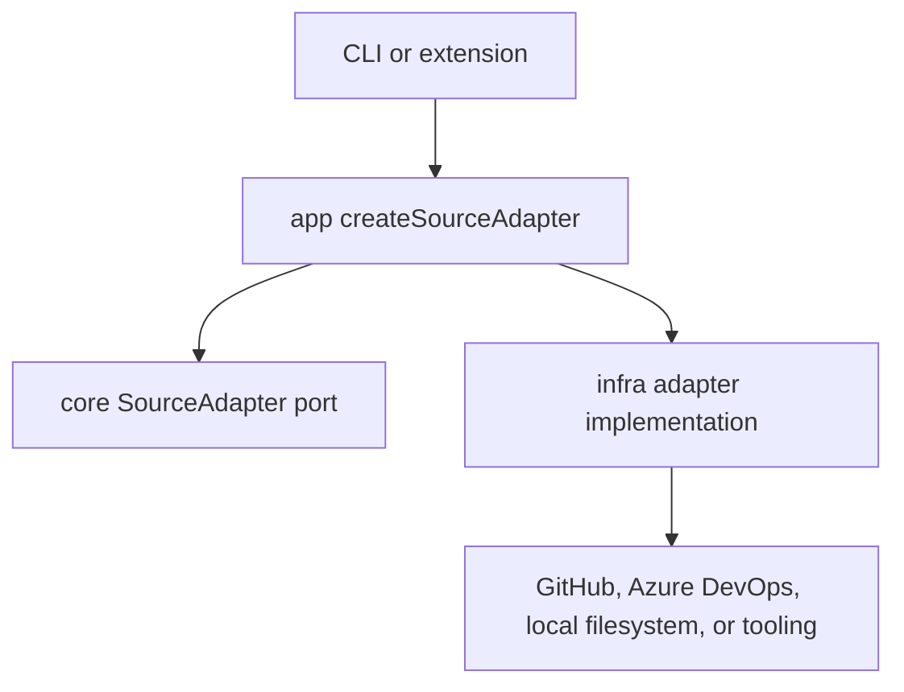

# Source Adapter Architecture

Source adapters normalize different collection sources behind the
`SourceAdapter` port in `packages/core/src/ports/source-adapter.ts`.

## Current Ownership



- `core` defines `SourceAdapter`, `RegistrySource`, `Bundle`, and related
  domain types.
- `infra` contains all concrete source adapters.
- `app` selects and constructs an adapter in
  `packages/app/src/registry/create-source-adapter.ts`.
- The extension compatibility factory supplies VS Code-specific token
  providers and Node port implementations, then delegates construction to
  `app`.

Do not add new concrete adapters to
`apps/vscode-extension/src/adapters/`. That directory contains delivery
wiring and compatibility types for remaining extension call sites.

## SourceAdapter Contract

Every adapter currently provides:

```typescript
interface SourceAdapter {
  readonly type: string;
  readonly source: RegistrySource;
  fetchBundles(): Promise<Bundle[]>;
  downloadBundle(bundle: Bundle): Promise<Buffer>;
  fetchMetadata(): Promise<SourceMetadata>;
  validate(): Promise<ValidationResult>;
  requiresAuthentication(): boolean;
  getManifestUrl(bundleId: string, version?: string): string;
  getDownloadUrl(bundleId: string, version?: string): string;
  downloadReadme(bundle: Bundle): Promise<string | null>;
  forceAuthentication?(): Promise<void>;
}
```

Actual installation always consumes the `Buffer` returned by
`downloadBundle`. Manifest and download URLs are retained for display and
diagnostics; they do not define a second installation API.

## Implemented Adapters

Concrete implementations are under `packages/infra/src/adapters/`:

| Source type | Adapter | Implementation file |
|---|---|---|
| `github` | `GitHubAdapter` | `github-adapter.ts` |
| `local` | `LocalAdapter` | `local-adapter.ts` |
| `awesome-copilot` | `AwesomeCopilotAdapter` | `awesome-copilot-adapter.ts` |
| `local-awesome-copilot` | `LocalAwesomeCopilotAdapter` | `local-awesome-copilot-adapter.ts` |
| `apm` | `ApmAdapter` | `apm-adapter.ts` |
| `local-apm` | `LocalApmAdapter` | `local-apm-adapter.ts` |
| `skills` | `SkillsAdapter` | `skills-adapter.ts` |
| `local-skills` | `LocalSkillsAdapter` | `local-skills-adapter.ts` |
| `azure-devops` | `AzureDevOpsAdapter` | `azure-devops-adapter.ts` |

This is the application registry-source list. The Hub configuration schema
currently accepts a narrower list, so do not infer valid Hub source types
from this table. See [Hub Schema](../../reference/hub-schema.md).

## Construction and Authentication

`createSourceAdapter` receives delivery-provided ports for filesystem, clock,
HTTP, process execution, and fallback token providers.

For authenticated sources:

1. An explicit token on the source is considered first.
2. Delivery-provided token providers are tried in order.
3. GitHub and Azure DevOps API clients receive the resulting provider.

The extension supplies its VS Code GitHub-session bridge followed by the
GitHub CLI provider. The CLI supplies its own available providers. See
[Authentication](./authentication.md).

## Adding a Source Type

1. Add or extend the source/domain type in `packages/core`.
2. Implement the `SourceAdapter` port in `packages/infra/src/adapters/`.
3. Export the adapter from the infra adapter index.
4. Add a construction case to
   `packages/app/src/registry/create-source-adapter.ts`.
5. Add focused adapter tests and application-factory tests.
6. Update user/reference documentation for any configuration fields.
7. If the source must be usable inside a Hub, update and test the Hub schema
   separately.

## See Also

- [Authentication](./authentication.md)
- [Installation Flow](./installation-flow.md)
- [Hub Schema](../../reference/hub-schema.md)
