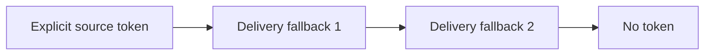
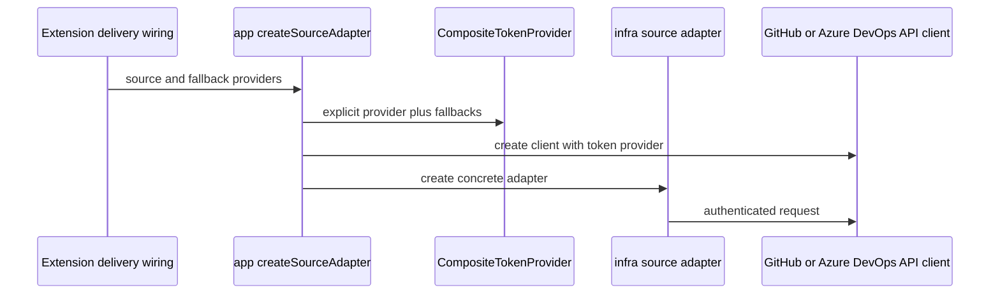

# Source Authentication

Authentication is provided to shared source adapters through the
`TokenProvider` port. The shared adapters do not import VS Code APIs or read
delivery-specific settings directly.

## Current Token Chain

`packages/app/src/registry/create-source-adapter.ts` builds a
`CompositeTokenProvider` for authenticated sources:

The order is:

1. `source.token`, when configured
2. Fallback providers supplied by the delivery layer, in their supplied order
3. Anonymous access when no provider returns a token

For the VS Code extension, the fallback providers are:

1. The selected VS Code GitHub authentication session
2. `gh auth token` through `GhCliTokenProvider`

The GitHub CLI provider has a three-second timeout so a missing or
unresponsive executable does not block the extension indefinitely.

## Construction Flow

GitHub API requests use the token format implemented by
`packages/infra/src/http/github-api-client.ts`. Azure DevOps uses its own
Basic-auth PAT encoding in `azure-devops-api-client.ts`. Bundle downloaders
may use a different authorization scheme required by their endpoint; use the
relevant client implementation as the authority.

## First-Run GitHub Account Selection

On first-run setup, the extension invokes
`promptGitHubAccountSelection` before Hub selection. It calls VS Code's GitHub
authentication provider with `clearSessionPreference: true`, allowing the
user to select an account even when VS Code already has a preferred session.

After selection, normal token-provider calls reuse the selected session. The
**Force GitHub Authentication** command remains available when the user needs
to choose another account.

If the first-run picker is dismissed, setup remains incomplete and can be
resumed later.

## Security Rules

- Do not commit tokens to Hub or collection repositories.
- Do not log full tokens or token previews.
- Keep authentication at delivery/infrastructure boundaries; do not import
  VS Code authentication APIs into `core` or `app`.
- Prefer the user's selected VS Code session or existing GitHub CLI session
  over copying credentials into configuration.
- Treat authentication failures separately from missing repositories when
  reporting private-source errors.

## See Also

- [Source Adapter Architecture](./adapters.md)
- [User Guide: Sources](../../user-guide/sources.md)
- [Creating a Hub](../../author-guide/creating-a-hub.md)
