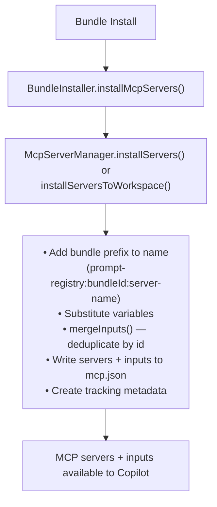
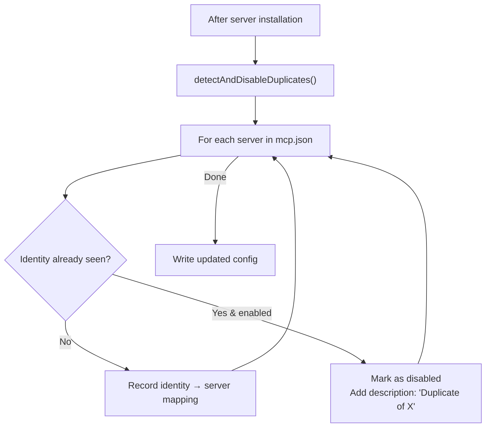

# MCP Integration

Bundles can include MCP (Model Context Protocol) servers that extend Copilot's capabilities.

## Components

| Component | Responsibility |
|-----------|---------------|
| **BundleInstaller** | Calls MCP install/uninstall during bundle lifecycle |
| **McpServerManager** | Orchestrates installation, naming, tracking, input merging |
| **McpConfigService** | Reads/writes VS Code's `mcp.json`, merges/cleans inputs |

## Installation Flow



## Server Types

### Stdio Servers (Local Process)

```yaml
mcpServers:
  server-name:
    type: stdio              # Optional (default)
    command: string          # Required
    args: string[]           # Optional
    env: Record<string, string>  # Optional
    envFile: string          # Optional - path to .env file
    disabled: boolean        # Optional (default: false)
    description: string      # Optional
```

### Remote Servers (HTTP/SSE)

```yaml
mcpServers:
  api-server:
    type: http               # Required: 'http' or 'sse'
    url: string              # Required - supports http://, https://, unix://, pipe://
    headers: Record<string, string>  # Optional - for authentication
    disabled: boolean        # Optional
    description: string      # Optional
```

## Variable Substitution

| Variable | Description |
|----------|-------------|
| `${bundlePath}` | Absolute path to bundle directory |
| `${bundleId}` | Bundle identifier |
| `${bundleVersion}` | Bundle version |
| `${env:VAR_NAME}` | Environment variable |
| `${input:id}` | VS Code input prompt (defined in `mcp.inputs`) |

## Input Definitions

Collections can define `mcp.inputs` to declare secrets or configurable values that VS Code will prompt the user for. These follow the [VS Code `mcp.json` inputs spec](https://code.visualstudio.com/docs/copilot/chat/mcp-servers).

### Schema

| Field | Type | Description |
|-------|------|-------------|
| `id` | string | Unique identifier, referenced as `${input:id}` in server config |
| `type` | `promptString` \| `pickString` \| `command` | Input type |
| `description` | string | Label shown to the user |
| `password` | boolean | Mask the value (for secrets) |
| `default` | string | Pre-filled default value |
| `options` | string[] | Choices for `pickString` type |

### Example

```yaml
mcp:
  inputs:
    - id: serviceToken
      type: promptString
      description: "Service access token (not stored)"
      password: true
    - id: serviceUser
      type: promptString
      description: "Service username"
    - id: servicePassword
      type: promptString
      description: "Service password or app password"
      password: true
  items:
    server-a:
      type: stdio
      command: podman
      args:
        - run
        - -e
        - "TOKEN=${input:serviceToken}"
        - my-mcp-server-a:latest
    server-b:
      type: stdio
      command: podman
      args:
        - run
        - -e
        - "USERNAME=${input:serviceUser}"
        - -e
        - "PASSWORD=${input:servicePassword}"
        - my-mcp-server-b:latest
```

### Merge Behaviour

When a collection is installed, its `mcp.inputs` are **merged** into the existing `mcp.json`:
- Inputs are deduplicated by `id` — the **existing** definition takes priority over incoming ones
- This allows multiple collections to share the same input without conflict
- Inputs are added to the top-level `inputs` array of `mcp.json`

## Deployment Manifest Format

When a collection is published as a GitHub release, `lib/bin/generate-manifest.js` converts the nested MCP section from `.collection.yml` into the deployment manifest. The generated deployment-manifest format uses top-level `mcpServers` and `mcpInputs` fields:

```yaml
mcpInputs:
  - id: serviceToken
    type: promptString
    description: "Service access token (not stored)"
    password: true
mcpServers:
  server-a:
    type: stdio
    command: podman
    args:
      - run
      - -e
      - "TOKEN=${input:serviceToken}"
      - my-mcp-server-a:latest
```

The nested `mcp.inputs` and `mcp.items` fields belong to the source collection format. Older deployment manifests may omit `mcpInputs` and contain only the top-level `mcpServers` field. The GitHub adapter reads the top-level deployment-manifest fields.

## Example

```yaml
mcpServers:
  custom-server:
    command: node
    args:
      - "${bundlePath}/servers/custom.js"
    env:
      BUNDLE_ID: "${bundleId}"
      API_KEY: "${env:MY_API_KEY}"
    description: Custom operations
```

## Uninstallation

1. Read tracking metadata for bundle's servers
2. Remove servers from `mcp.json`
3. Remove **orphaned inputs** — any `${input:id}` no longer referenced by any remaining server is removed from the `inputs` array
4. Update tracking metadata
5. Atomic operations with backup/rollback

> **Shared inputs are preserved**: if another installed bundle's server still references an input, it is kept.

## Duplicate Detection Algorithm

When multiple bundles define the same MCP server, duplicates are automatically detected and disabled.

### Server Identity Computation

```typescript
computeServerIdentity(config: McpServerConfig): string {
    if (isRemoteServerConfig(config)) {
        return `remote:${config.url}`;
    } else {
        const argsStr = config.args?.join('|') || '';
        return `stdio:${config.command}:${argsStr}`;
    }
}
```

| Server Type | Identity Format | Example |
|-------------|-----------------|----------|
| Stdio | `stdio:{command}:{args joined by \|}` | `stdio:node:server.js\|--port\|3000` |
| Remote | `remote:{url}` | `remote:https://api.example.com/mcp` |

### Detection Flow



### Lifecycle Behavior

1. **Install**: First server with identity stays enabled; duplicates disabled
2. **Uninstall**: When active server's bundle is removed, remaining duplicates are re-evaluated
3. **Invariant**: At least one server per identity remains active until all bundles are removed

### Type Guards

```typescript
// Discriminate server types
isStdioServerConfig(config)  // true if has 'command', no 'url'
isRemoteServerConfig(config) // true if has 'url' and type is 'http'|'sse'
```

## Config File Locations

IDE-specific MCP paths and the JSON root key live in
`packages/infra/src/writers/default-layouts.json`, inside each target's **per-scope**
`mcpConfig` entry, resolved by `McpConfigLocator`. To add or change an IDE, edit that
file rather than the locator.

`mcpConfig` sits alongside `baseDir` inside `user` and `repository`, so it layers the
same way as the primitive layout fields:

```json
"kiro": {
  "user": {
    "baseDir": "${HOME}/.kiro",
    "kindRoutes": { "prompts/": "steering/" },
    "mcpConfig": {
      "path": "${HOME}/.kiro/settings/mcp.json",
      "serversKey": "mcpServers"
    }
  },
  "repository": {
    "baseDir": "${workspaceRoot}/.kiro",
    "kindRoutes": { "prompts/": "steering/" },
    "mcpConfig": {
      "path": "${workspaceRoot}/.kiro/settings/mcp.json",
      "serversKey": "mcpServers"
    }
  }
}
```

| Field | Meaning |
|-------|---------|
| `path` | Full path template to the config file, including the filename. Tokens are resolved by `resolvePathTokens`. |
| `serversKey` | JSON root key for the server map: `servers` (VS Code) or `mcpServers` (all other known IDEs). |

### Path Tokens

One resolver handles all tokens, and an unknown or empty token raises
`UnresolvedPathTokenError` rather than resolving to an empty string or surviving into
the path. That matters: an unresolved token would otherwise create a directory
literally named `${...}`, and an empty `${HOME}` would turn
`${HOME}/.kiro/mcp.json` into an absolute `/.kiro/mcp.json`.

| Token | Value |
|-------|-------|
| `${HOME}` | User home directory. |
| `${workspaceRoot}` | Absolute workspace root. Required in every `repository` path. |
| `${vscodeUserDir}` | VS Code user data `User` directory, resolved from the running host. |

`${vscodeUserDir}` exists because VS Code is the only supported host whose config
directory is neither HOME-relative nor identical across platforms: it follows each OS's
app-data convention, the `Code` segment varies by variant (Insiders, Cursor, Windsurf,
Kiro), and portable installs, `--user-data-dir` and remote sessions move it entirely.

### Scope Independence

A missing `mcpConfig` means **the IDE has no MCP config file at that scope**. It is
never inherited from the other scope, unlike `baseDir`, where `repository` falls back to
`user`. Windsurf and Copilot CLI have no workspace-level MCP file, so inheriting the
user entry would make a repository-scope install write into the user's home config.

Note the consequence: two fields in the same object have opposite inheritance rules.
`resolveLayoutFromLayers` does `repository ?? user`; `resolveMcpLayoutConfig`
deliberately does not.

### On-disk Syntax

Files are always read with the JSONC parser, so comments and trailing commas are
accepted regardless of host. There is deliberately **no** `format` field: writes
currently go through `JSON.stringify`, so nothing would branch on it.

Known gap: because writes replace the whole file, **comments and formatting in a
user's `mcp.json` are lost on write**. Comment-preserving writes would use
`jsonc-parser`'s `modify`/`applyEdits` to touch only changed keys, and a `format` field
belongs here only once that exists to consume it.

### Known Limitation: VS Code Profiles

For VS Code and VS Code Insiders the user-level path resolves through
`${vscodeUserDir}`, which comes from `context.globalStorageUri`
(`<userDataDir>/User/mcp.json`).

**This always resolves to the default profile.** VS Code supports per-profile MCP
configuration, where a non-default profile's file lives at
`<userDataDir>/User/profiles/<profileId>/mcp.json`. A user-scope install performed while a
non-default profile is active therefore writes to a file the active profile does not read —
the server is written successfully but never appears. Workspace-scope installs are
unaffected, since `.vscode/mcp.json` is profile-independent.

This is not fixable with the current extension API. There is no supported way to obtain the
active profile's directory:

- [microsoft/vscode#160466](https://github.com/microsoft/vscode/issues/160466) — requests a
  profile-aware `globalStorageUri`; closed as not planned.
- [microsoft/vscode#211890](https://github.com/microsoft/vscode/issues/211890) — requests a
  Profiles API; closed as not planned.

The profile ID cannot be expressed as a `path` template either, since it is neither
HOME-relative nor knowable at authoring time. Confining resolution to the single
`${vscodeUserDir}` token keeps the fix a one-function change if VS Code ever ships an API.

The long-term fix is [`vscode.lm.registerMcpServerDefinitionProvider`](https://code.visualstudio.com/docs/copilot/guides/mcp-developer-guide),
which lets the extension contribute MCP servers programmatically and hands storage and
profile scoping to VS Code, removing the need to write `mcp.json` for VS Code at all. That
only covers VS Code, so file-based writing remains for Kiro, Windsurf, Claude Code and
Copilot CLI.

## See Also

- [Installation Flow](./installation-flow.md) — Bundle installation
- [Author Guide: Collection Schema](../../author-guide/collection-schema.md) — MCP in manifests
