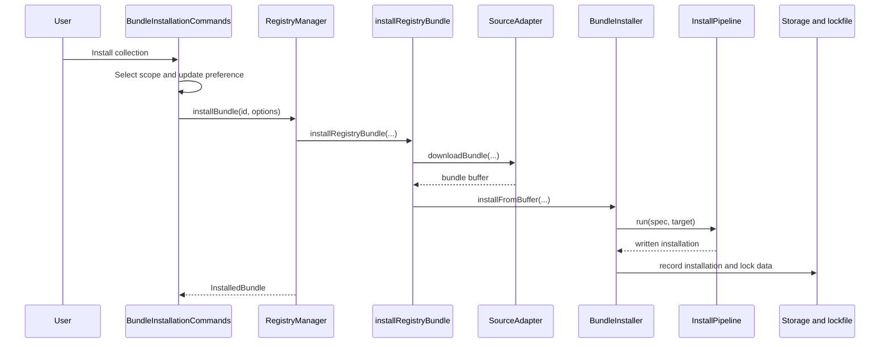
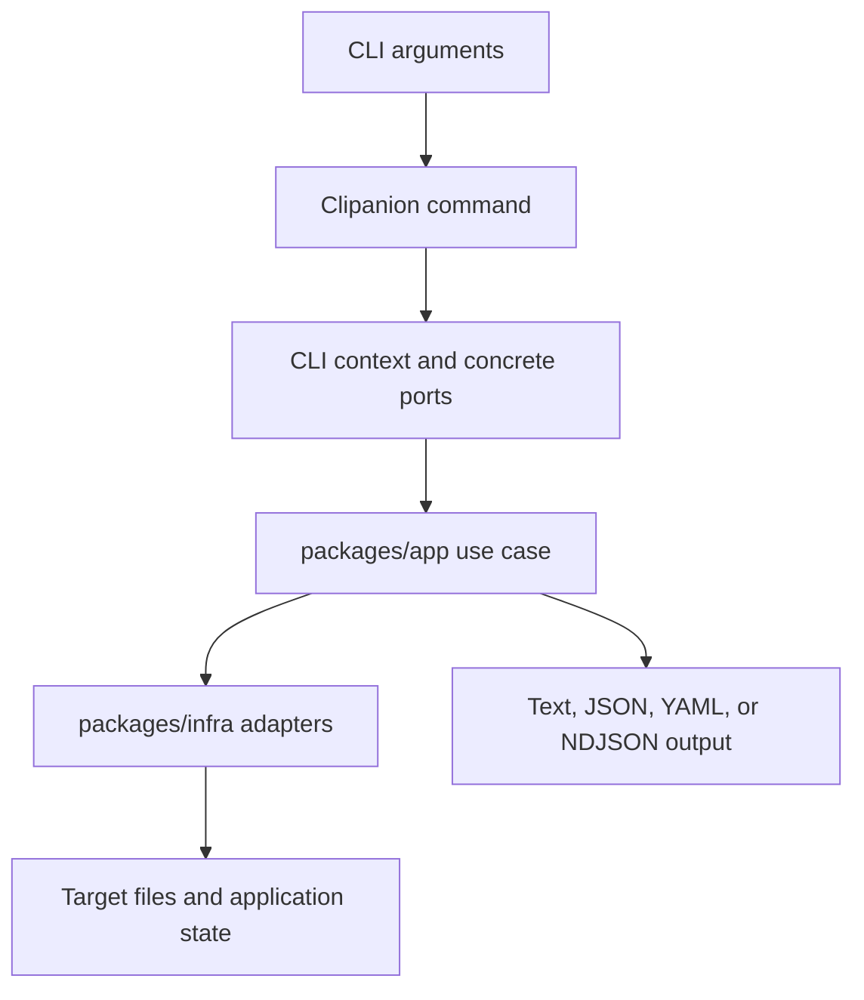
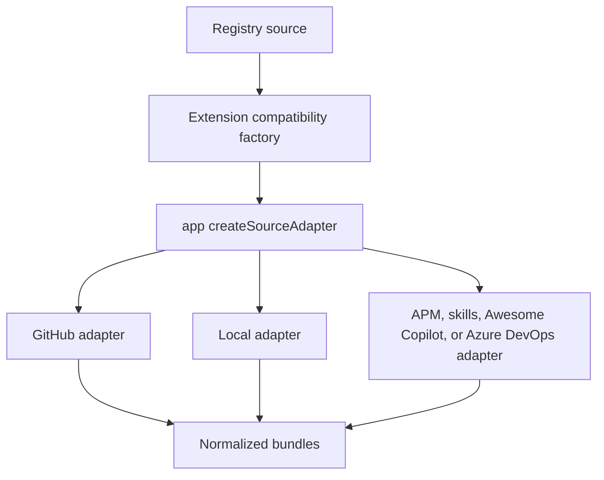
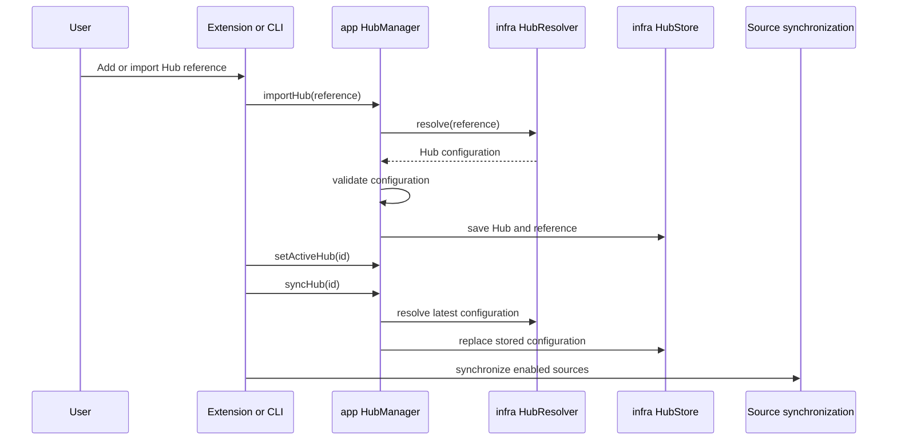

# Core System Flows

This page is a code-oriented map of the principal flows implemented today.
It complements the [architecture overview](./architecture.md); focused pages
contain the detailed rules for each subsystem.

## Detailed Flow References

The previous single-page flow guide mixed current behavior with older
extension-owned paths. Detail now lives in these current, subsystem-specific
pages:

| Area | Detailed page |
|---|---|
| Installation, scope, lockfiles, rollback, and uninstall | [Installation Flow](./architecture/installation-flow.md) |
| Source adapter contract, implementations, and extension steps | [Adapters](./architecture/adapters.md) |
| Token providers and host-specific authentication | [Authentication](./architecture/authentication.md) |
| Update detection, preferences, and notifications | [Update System](./architecture/update-system.md) |
| Hub authoring, user behavior, and schema | [Creating a Hub](../author-guide/creating-a-hub.md), [Profiles and Hubs](../user-guide/profiles-and-hubs.md), and [Hub Schema](../reference/hub-schema.md) |
| Validation ownership and execution | [Validation Architecture](./architecture/validation.md) |
| MCP discovery, merge, and persistence | [MCP Integration](./architecture/mcp-integration.md) |
| Marketplace and tree-view delivery behavior | [UI Components](./architecture/ui-components.md) |

## 1. Extension Installation

The VS Code command entry point is
`apps/vscode-extension/src/commands/bundle-installation-commands.ts`.

Current responsibility split:

- `BundleInstallationCommands` owns VS Code prompts, progress, and messages.
- `RegistryManager.installBundle` adapts extension storage and services to the
  shared `installRegistryBundle` use case.
- The selected source adapter downloads or builds the bundle buffer.
- `BundleInstaller` supplies extension-specific pipeline ports, scope
  services, lockfile handling, and MCP integration.
- `packages/app/src/install/pipeline.ts` implements the generic resolve,
  download, extract, validate, cache, and target-write sequence.

Repository installation has additional committed and local-only behavior.
See [Installation Flow](./architecture/installation-flow.md).

## 2. CLI Installation

The CLI is a separate delivery path. Clipanion commands under
`packages/cli/src/commands/` build a command context and call application
operations with Node-based infrastructure implementations.

The CLI and extension share domain and application code, but their outer
wiring and persisted delivery-specific state are not identical.

## 3. Source Discovery

The extension no longer constructs concrete source adapters from its old
adapter implementations. Its compatibility factory in
`apps/vscode-extension/src/adapters/infra-adapter-factory.ts` delegates to
`packages/app/src/registry/create-source-adapter.ts`, which selects concrete
adapters from `packages/infra/src/adapters/`.

To add a source type, define the domain type in `core`, implement the
`SourceAdapter` port in `infra`, and register it in the application factory.
Do not add a new concrete adapter to the extension compatibility directory.
See [Adapters](./architecture/adapters.md).

## 4. Authentication

Source authentication is assembled at the delivery boundary and exposed to
shared infrastructure through token-provider ports.

For GitHub operations in the extension, the current fallback chain is:

1. VS Code GitHub authentication session
2. GitHub CLI token
3. Explicitly configured token where supported

The concrete wiring is documented in
`apps/vscode-extension/src/adapters/AGENTS.md` and implemented by
`vscode-session-token-provider.ts`, the infrastructure token providers, and
the extension adapter factory. See [Authentication](./architecture/authentication.md)
for security and host-specific details.

## 5. Hub Import and Synchronization

Hubs distribute source definitions and shared profiles. The shared Hub
manager resolves the configuration from a GitHub repository, direct URL, or
local file and stores the imported Hub and its reference.

For a GitHub reference, the shared resolver fetches `hub-config.yml` from the
repository root and uses `main` unless another ref is supplied. A local
reference is a direct path to a YAML file, not merely its containing
directory.

See [Creating a Hub](../author-guide/creating-a-hub.md),
[Profiles and Hubs](../user-guide/profiles-and-hubs.md), and
[Hub Schema](../reference/hub-schema.md).

## 6. Update and Uninstall

- Bundle update detection and auto-update behavior are shared through
  application services with extension wrappers for notifications and events.
- Uninstallation is coordinated by
  `packages/app/src/registry/uninstall-installed-bundle.ts`; the extension
  provides the appropriate user/repository scope removal and storage hooks.
- Hub synchronization is separate from bundle update detection. Updating a
  Hub refreshes its configuration and sources; it does not mean that every
  installed bundle is automatically replaced.

See [Update System](./architecture/update-system.md) and
[Installation Flow](./architecture/installation-flow.md) for detailed
rollback, tracking, and scope behavior.

## Quick Reference

| Flow | Delivery entry point | Shared implementation |
|---|---|---|
| Extension install | `bundle-installation-commands.ts` | `install-registry-bundle.ts`, `InstallPipeline` |
| Extension uninstall | `RegistryManager.uninstallBundle` | `uninstall-installed-bundle.ts` |
| Source construction | `infra-adapter-factory.ts` | `create-source-adapter.ts`, infra adapters |
| Hub management | Extension/CLI Hub commands | `packages/app/src/registry/hub-manager.ts` |
| MCP configuration | Extension MCP manager/services | Shared MCP format, locator, and layout helpers |
| Search | Extension marketplace or CLI index commands | App search orchestration and infra search/index implementations |

File names above are relative to the component directory named in the text.
Search the current implementation before introducing another orchestration
path or duplicating an existing use case.
